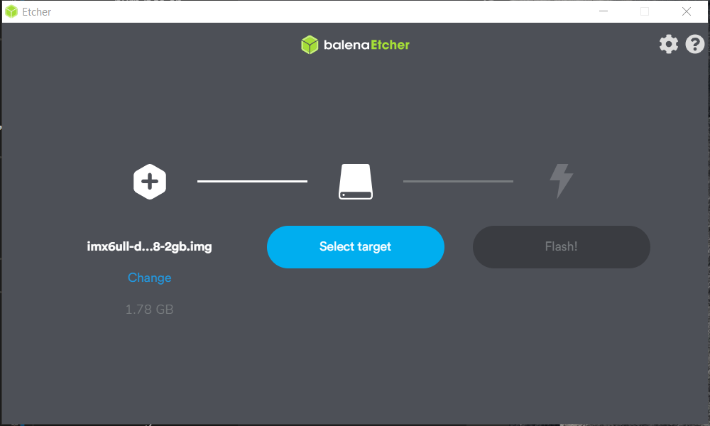

# NPi i.MX6ULL Dev Board - Linux SBC

 

The NPi i.MX6ULL Dev Board is a low power consumption Linux single board computer built around the powerful i.MX6ULL. You would love the onboard 512MB DDR3L and 256MB NAND, not to mention the rich interfaces and I/O resources.

At the same time, we provide you with a wealth of software resources. You can find debian/ubuntu/yocto and system distribution images [here](https://github.com/Seeed-Studio/image-builder). Meanwhile, we also provide lots of Pi hats kernel and application layer. Hence, you can put your favorite Pi hat directly into this board to use. Most of SeeedStudio Pi Hats can work with NPi i.MX6ULL Dev Board (except ReSpeaker 6-Mic Circular Array Kit for Raspberry Pi and ReSpeaker 4-Mic Linear Array Kit for Raspberry Pi). You can also use our Grove base PI Hat to prototype whatever you like with Grove modules. Please follow us on Github for the latest software updates.

The whole board is made by a core module and a breakout board, and the components are all industrial grade.

The core module is composed of the i.MX6ULL core and 512MB DDR3L, 256MB NAND FLASH(or 8GB eMMC). In fact, depending on the Flash, the NPi i.MX6ULL Dev Board can be divided into two different Version.

- [NPi i.MX6ULL Dev Board - 8G eMMC Version](https://www.seeedstudio.com/NPi-i-MX6ULL-Dev-Board-Industrial-Grade-Linux-SBC-eMMC-Version-p-4221.html)
- [NPi i.MX6ULL Dev Board - 256MB NAND FLASH Version](https://www.seeedstudio.com/NPi-i-MX6ULL-Dev-Board-Industrial-Grade-Linux-SBC-NAND-Version-p-4220.html)
 
The breakout board mainly includes various peripheral interfaces and input and output, IO expansion. Including but not limited to two 100M ethernet port, one USB Host and one USB OTG port, one 24bit RGB LCD Interface, 2x 40 Pin I/O expansion header, etc. Such a wealth of resources will meet your various control needs. All those features make it a perfect solution for industrial control, rail transit, drone control, and audio output, etc.

NPi i.MX6ULL Dev Board - 8G eMMC Version:

[](https://www.seeedstudio.com/NPi-i-MX6ULL-Dev-Board-Industrial-Grade-Linux-SBC-eMMC-Version-p-4221.html)

NPi i.MX6ULL Dev Board - 256MB NAND FLASH Version:

[](https://www.seeedstudio.com/NPi-i-MX6ULL-Dev-Board-Industrial-Grade-Linux-SBC-NAND-Version-p-4220.html)


## Features

- Arm-Cortex-A7 core processor 
- Industrial grade
- Low power consumption 
- debian/ubuntu/yocto OS
- Raspberry Pi 40-Pin Compatible Carrier Board.

## Specification

|Item|Values|
|----|------|
|Peripheral Interface| 1 x USB Host<br>2 x 100M Ethernet interface<br>1 x FPC LCD interface (including 24 bit RGB and I2C touch control)<br>1 x SD card interface (on the back of the board)<br>1 x Uart interface<br>2 x 40pin header|
|On-board LED|3 x user-defined LED<br>1 x power LED<br>1 x Heartbeat LED|
|Power|1 x DC interface (5V±2%)<br>1 x USB Type - C|
|Button|4 x key|
|Switch|1 X 8-digit DIP switch|
|RTC|1 x RTC battery slot|
|CPU|1 X NXP MCIMX6Y2CVM08AB|
|Frequency|up to 800Mhz|
|DDR3L|onboard 512MB|
|eMMC|onboard 8GB(NPi i.MX6ULL Dev Board - 8G eMMC Version)|
|NAND|onboard 256M(NPi i.MX6ULL Dev Board - 256MB NAND FLASH Version)|
|dimension|61mm x 100mm|
|Operating temperature | -20℃ ~ 80℃ |

<div class="admonition note" >
<p class="admonition-title">Note</p>
The operating temperature here refers specifically to the Core module, and the temperature range of the Breakout Board is narrower. We have not tested the specific temperature range of the Breakout Board.
</div>

## Application

- Industrial (CAN-Ethernet gateways etc)
- White goods(refrigerators,microwaves etc)
- Smart Home Devices

## Hardware Overview

### Interface

 

**100M Ethernet Interface with LEDs**: 2 x 100M Ethernet interfaces

**5V Power Jack**: Use 5V ± 2% single power supply

**Overvoltage protection indicator**: When this lamp is on, it indicates that the voltage is out of range

**USB Device Type C**: USB Type C interface

**UART TTL**: direct lead from serial port of main controller

**Heartbeat LED**: The heartbeat light will flash continuously after the system is running

**Power LED**:the LED will turn on when power on the board.

**Raspberry Pi Compatitle Header**: includes UART, I2C, SPI, PWM and other compatible Raspberry Pi IO interfaces

**LCD FPC interface**: including 24-bit RGB interface and I2C touch screen control interface

**Reset & User Button**: There are 4 buttons in total, which are reset, ON / OFF, normal button and Mode switch button

**USB Host Type A**: USB Host interface

**8-Digit DIP Switch**: An 8-bit DIP switch that supports switching between NAND, eMMC, SD, and USB boot modes

**Extra GPIO Header**: Contains a 74LV595PW chip, which expands a 4-channel IO into 8-channel

**User LED**:Programmable LED

**RTC Battery Slot**: can be connected to the CR1220 battery to power the RTC

**Micro SD Card Slot**: micro SD card slot, supports SD card 3.0
 
### Pin Function


## Introduction To Software

### Preparatory Work

**Materials Required**

- NPi i.MX6ULL Dev Board - Linux SBC NAND Version(or eMMC Version)
- 4GB (or more memory) SD card and SD card reader
- PC or Mac
- [USB To Uart Adapter](https://www.seeedstudio.com/USB-To-Uart-5V%26amp%3B3V3-p-1832.html) (optional)
- A USB type-c cable

<div class="admonition warning">
<p class="admonition-title">Caution</p>
Please plug the USB cable gently, otherwise you may damage the interface.Please use the USB cable with 4 wires inside, the 2 wires cable can't transfer data. If you are not sure about the wire you have, you can click <a href="https://www.seeedstudio.com/USB-3-1-Type-C-to-A-Cable-1-Meter-3-1A-p-4085.html"><B>here</B></a> to buy
</div>

**Mirror Installation**

you need to install the NPi i.MX6ULL Dev Board - Linux SBC image from your SD card to get it up and running. 

**A. Boot from SD card**

- **Step 1.** Select the latest [firmware](https://files.seeedstudio.com/linux/NPi+i.MX6ULL/imx6ull-debian-buster-console-armhf-latest-2gb.img.xz)

- **Step 2.** Connect an SD card to a PC or MAC with an SD card reader, an SD card with more than 4G memory is required.

- **Step 3.** <font face="">Click here to download <a href="https://etcher.io/">Etcher</a>, then use the Etcher to write the  ```*.img.xz``` file directly to the SD card. Or extract the ```*.img.xz``` file into a ```*.img``` file, and then burn it to an SD card using another mirror write tool. 
<br>
<br>Click the plus icon to add the newly downloaded image file and the software will automatically select the SD card you inserted. Then click Flash! writing. It takes about 10 minutes to finish.</font>



- **Step 4.** After writing the image to the SD card, insert the SD card into NPi i.MX6ULL Dev Board - Linux SBC.Set the 8-digit DIP switch to 2-5-8 mode to enable boot from SD.

- **Step 5.** Use USB type-c port to power the board. Do not take out the SD card during writing. NPi i.MX6ULL Dev Board - Linux SBC will boot from the SD card, you can see the PWR and Heatbeat LED lighting on Board. 

<div class="admonition note" >
<p class="admonition-title">Note</p>
if Heartbeat LED cannot flash, it means starting failed. Please check the image whether it installs fine.
</div>
    

## Resourses
-----

- **[PDF]** [i.MX 6ULL datasheet](/REG/IMX6ULLCEC.pdf)
- **[PDF]** [NPi i.MX6ULL Dev Board - Linux SBC Mechanical_Dimensions](/REG/Mechanical_Dimensions.pdf)

## Tech Support
Please submit any technical issue into our [forum](http://forum.seeedstudio.com/). <br /><p style="text-align:center"><a href="https://www.seeedstudio.com/act-4.html?utm_source=wiki&utm_medium=wikibanner&utm_campaign=newproducts" target="_blank"></a></p>
